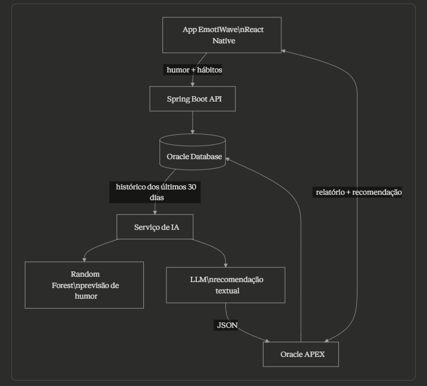

# EmotiWave — Componente de Inteligência Artificial

## Integrantes

- Jhonatta Lima Sandes de Oliveira – RM 560277
- Lucas José Lima – RM 561160
- Rangel Bernardi Jordão – RM 560547

---

## Sobre o projeto

O **EmotiWave** é um aplicativo mobile de bem-estar digital que permite ao usuário registrar seu humor diariamente, visualizar relatórios via Oracle APEX e receber recomendações baseadas em inteligência artificial.

---

## Problema de IA

O EmotiWave coleta dados de humor ao longo do tempo. O problema de IA consiste em:

1. Identificar padrões no histórico emocional do usuário
2. Detectar tendências (melhora, piora ou estabilidade)
3. Gerar recomendações personalizadas em linguagem natural

---

## Modelo de IA escolhido

A solução utiliza duas camadas complementares:

| Camada            | Modelo                     | Função                                  |
| ----------------- | -------------------------- | --------------------------------------- |
| Análise preditiva | Random Forest / Regressão  | Analisa padrões e tendência do humor    |
| Recomendações     | LLM (GPT / Claude via API) | Gera recomendações em linguagem natural |

**Justificativa:**  
Os dados de humor são estruturados (valores de 1 a 5 ao longo do tempo), o que permite o uso de modelos simples e eficientes como regressão ou classificação.  
O LLM complementa a análise gerando uma resposta mais natural e compreensível para o usuário.

---

## Dados utilizados

| Dado                  | Origem          | Formato              | Volume mínimo    |
| --------------------- | --------------- | -------------------- | ---------------- |
| Humor diário          | Registro no app | Inteiro (1–5) + data | 7 registros      |
| Histórico consolidado | Oracle Database | Tabular / JSON       | 1 semana ou mais |

---

## Diagrama de integração

---

## Fluxo de funcionamento da IA

1. O usuário registra seu humor no aplicativo
2. Os dados são enviados para a API em Spring Boot
3. As informações são armazenadas no Oracle Database
4. O Oracle APEX consulta o histórico de humor (últimos dias)
5. Os dados são enviados ao serviço de IA
6. O modelo analisa padrões e identifica tendências
7. O LLM gera uma recomendação textual
8. A resposta retorna em formato JSON
9. A recomendação é exibida no aplicativo

---

## Observação

Nesta etapa do projeto, a inteligência artificial está **definida e documentada**, com integração planejada ao sistema.  
A exibição da recomendação já está prevista na interface do aplicativo, mas ainda não está conectada ao modelo de IA.

---

## Estrutura do Projeto

- `mobile/`: aplicação mobile desenvolvida em React Native
- `backend/`: API desenvolvida em Spring Boot para integração com banco e serviços

## Tecnologias Utilizadas

- React Native
- TypeScript
- Spring Boot
- Java
- Oracle Database
- Oracle APEX
- Inteligência Artificial (modelo preditivo + LLM)

## Como Executar

### Mobile

1. Acesse a pasta `mobile`
2. Instale as dependências
3. Execute o projeto com Expo

### Backend

1. Acesse a pasta `backend`
2. Configure as variáveis de ambiente e conexão com o banco
3. Execute a aplicação Spring Boot

## Resultados Parciais

- Aplicativo mobile com registro de humor
- Backend integrado ao banco de dados
- Relatórios via Oracle APEX
- Arquitetura da IA definida e documentada
- Ponto de exibição da recomendação já previsto na interface

---

## Links

- [Vídeo no YouTube](https://youtu.be/fdbxqFJR6Ho)
