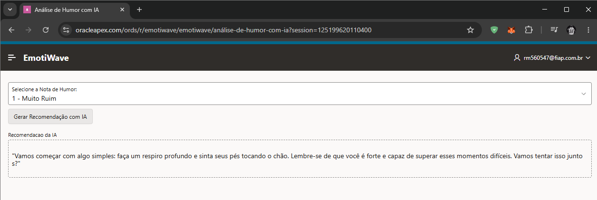
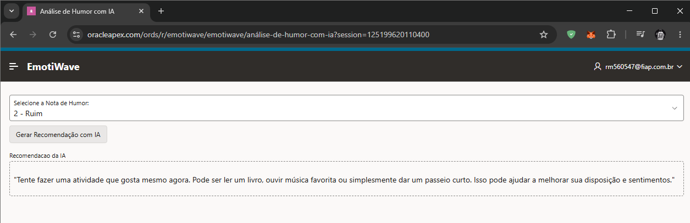
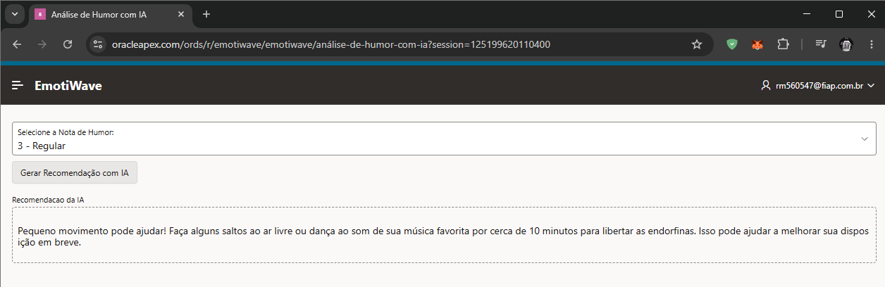
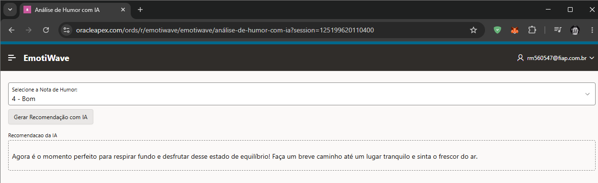
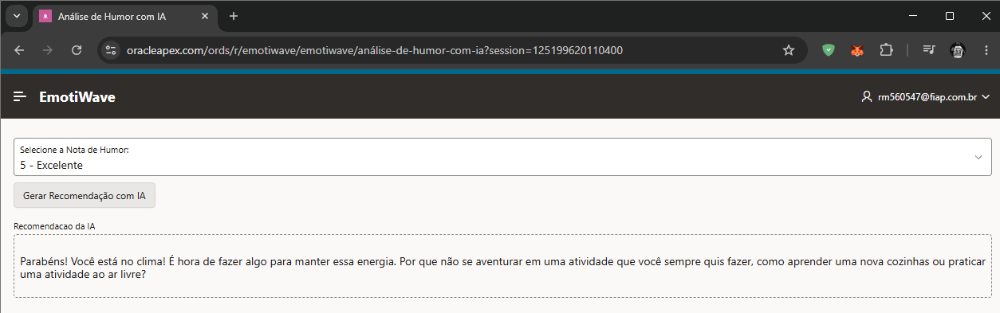

# EmotiWave — Sistema de Inteligência Artificial & IoB

## Integrantes

- Jhonatta Lima Sandes de Oliveira – RM 560277
- Lucas José Lima – RM 561160
- Rangel Bernardi Jordão – RM 560547

---

## 🎯 Objetivo da Entrega

Este projeto implementa o modelo de Inteligência Artificial para o sistema **EmotiWave**, integrando análise comportamental (IoB - Internet of Behavior) com modelos generativos (LLMs) diretamente ao ecossistema Oracle APEX e dispositivos móveis.

O objetivo principal desta etapa foi desenvolver uma solução funcional capaz de:

- Coletar dados comportamentais do usuário;
- Processar informações emocionais utilizando IA generativa;
- Integrar a inteligência artificial ao Oracle APEX;
- Disponibilizar recomendações inteligentes em tempo real;
- Validar o funcionamento da solução através de testes e evidências práticas.

---

## 🧠 Arquitetura Técnica de IA

A implementação foi otimizada para alta disponibilidade e integração entre múltiplas camadas do sistema.

### Modelo de Inteligência Artificial

Utilizamos o modelo generativo **Llama 3**, acessado através da API da plataforma **Groq**.

A análise comportamental é realizada pelo próprio LLM a partir do histórico emocional enviado no prompt, permitindo identificar tendências, padrões e gerar recomendações personalizadas em linguagem natural.

### Fluxo Técnico

- O aplicativo coleta registros emocionais do usuário;
- Os dados são persistidos no Oracle Database via Spring Boot;
- O backend processa os dados e envia o contexto ao modelo Llama 3;
- A IA gera recomendações personalizadas;
- O Oracle APEX consome a IA via REST utilizando PL/SQL;
- As respostas são exibidas dinamicamente na interface administrativa e no aplicativo mobile.

---

## 🛠️ Implementação Técnica

### 1. Backend e Serviço de IA

Foi desenvolvido um serviço REST em Spring Boot responsável por:

- Receber os dados emocionais do usuário;
- Organizar o histórico de humor;
- Construir o prompt contextual;
- Consumir a API Groq;
- Retornar recomendações em formato JSON.

### 2. Integração Oracle APEX

A integração com Oracle APEX foi implementada utilizando recursos nativos da plataforma.

#### Tecnologias utilizadas na integração

- `APEX_WEB_SERVICE`
- `PL/SQL`
- `APEX_JSON`
- REST API

### Funcionamento da integração

O Oracle APEX realiza chamadas REST diretamente para o serviço de IA utilizando o procedimento:

```sql
apex_web_service.make_rest_request
```

O retorno JSON da IA é tratado via `APEX_JSON` e exibido dinamicamente na interface administrativa.

---

## 🧪 Testes e Evidências de Funcionamento

Foram realizados testes completos para validar:

- Comunicação REST entre Oracle APEX e serviço de IA;
- Envio correto do payload JSON;
- Processamento do prompt pelo modelo Llama 3;
- Geração de recomendações contextualizadas;
- Retorno correto da resposta em JSON;
- Renderização dinâmica da resposta no Oracle APEX.

### Evidências de Execução

| Nota de Humor  | Evidência                |
| :------------- | :----------------------- |
| 1 - Muito Ruim |  |
| 2 - Ruim       |  |
| 3 - Regular    |  |
| 4 - Bom        |  |
| 5 - Excelente  |  |

---

## 🚀 Fluxo Integrado da Solução

### 1. Captura de Dados (IoB)

O usuário registra seu humor diariamente no aplicativo mobile.

### 2. Persistência dos Dados

As informações são armazenadas no Oracle Database através da API Spring Boot.

### 3. Processamento Inteligente

O backend envia o histórico emocional para o modelo Llama 3 via API Groq.

### 4. Geração de Recomendações

A IA interpreta os dados e gera recomendações personalizadas em linguagem natural.

### 5. Consumo pelo Oracle APEX

O painel administrativo realiza chamadas REST para validar e visualizar as respostas da IA diretamente no Oracle APEX.

### 6. Exibição ao Usuário

As recomendações são exibidas tanto no aplicativo mobile quanto na interface administrativa.

---

## 💻 Tecnologias Utilizadas

### Mobile

- React Native
- Expo
- TypeScript

### Backend

- Java
- Spring Boot
- REST API

### Banco de Dados e Dashboard

- Oracle Database
- Oracle APEX
- PL/SQL

### Inteligência Artificial

- Groq API
- Llama 3
- IA Generativa

---

## 📂 Organização do Repositório

```text
/mobile   -> Aplicação mobile em React Native
/backend  -> API Spring Boot e integração com IA
/docs     -> Evidências de testes e imagens
README.md -> Documentação técnica do projeto
```

---

## ▶️ Como Executar

### Mobile

1. Acesse a pasta `mobile`
2. Instale as dependências
3. Execute o projeto com Expo

```bash
cd mobile
npm install
npx expo start
```

### Backend

A API está hospedada no Render e não é necessário executá-la localmente.

A API está hospedada no plano gratuito do Render.
Por isso, após um período de inatividade, o serviço pode entrar em modo de “sleep”.

Se houver demora no primeiro acesso, basta aguardar alguns instantes.

---

## 📊 Resultados Obtidos

- Integração funcional entre IA e Oracle APEX;
- Comunicação REST funcionando corretamente;
- Recomendações inteligentes geradas em tempo real;
- Processamento de dados emocionais via LLM;
- Exibição dinâmica das respostas no sistema;
- Integração completa entre Mobile, Backend, Oracle Database e IA.

---

## 🎥 Demonstração

**Link do vídeo:**

- [Vídeo Demonstração](https://youtu.be/aO21I3ZdE9s)
